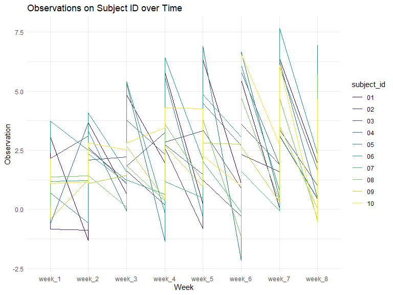
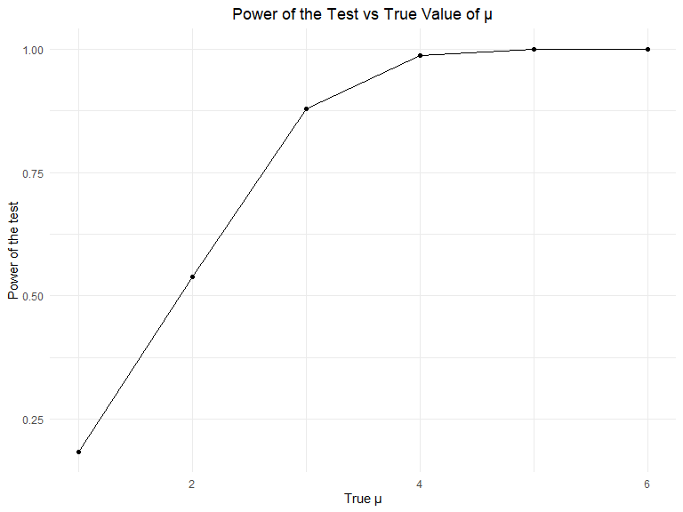
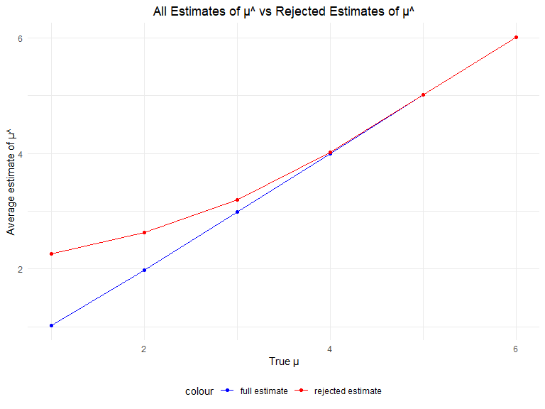

p8105_hw5_qra2000
================
Quinn Anderson
2023-11-14

### Setup, load libraries, and set seed for reproducibility.

``` r
library(tidyverse)
```

    ## ── Attaching core tidyverse packages ──────────────────────── tidyverse 2.0.0 ──
    ## ✔ dplyr     1.1.3     ✔ readr     2.1.4
    ## ✔ forcats   1.0.0     ✔ stringr   1.5.0
    ## ✔ ggplot2   3.4.3     ✔ tibble    3.2.1
    ## ✔ lubridate 1.9.2     ✔ tidyr     1.3.0
    ## ✔ purrr     1.0.2     
    ## ── Conflicts ────────────────────────────────────────── tidyverse_conflicts() ──
    ## ✖ dplyr::filter() masks stats::filter()
    ## ✖ dplyr::lag()    masks stats::lag()
    ## ℹ Use the conflicted package (<http://conflicted.r-lib.org/>) to force all conflicts to become errors

``` r
knitr::opts_chunk$set(
    echo = TRUE,
    warning = FALSE,
    fig.width = 8, 
  fig.height = 6,
  out.width = "90%")

theme_set(
  theme_minimal() +
  theme(legend.position = "bottom", plot.title = element_text(hjust = 0.5)))

options(
  ggplot2.continuous.colour = "viridis",
  ggplot2.continuous.fill = "viridis")

scale_colour_discrete = scale_colour_viridis_d
scale_fill_discrete = scale_fill_viridis_d

set.seed(12345)
```

## Problem 2

Below is a tidy dataframe containing data from all participants,
including the subject ID, control arm, and observations over time:

``` r
load_study_data = list.files("./data", pattern = ".csv", all.files = FALSE, full.names = FALSE)

tidy_study_data = data.frame(participants = load_study_data) |> 
  mutate(
    file_contents = map(participants, ~read.csv(file.path("./data", .)))) |> 
  separate(participants, into = c("control", "subject_id")) |> 
  unnest(file_contents) |> 
  mutate(control = recode(control, `con` = "control", `exp` = "experiment")) |> 
  pivot_longer(week_1:week_8,
               names_to = "week", 
               values_to = "observation")

tidy_study_data
```

    ## # A tibble: 160 × 4
    ##    control subject_id week   observation
    ##    <chr>   <chr>      <chr>        <dbl>
    ##  1 control 01         week_1        0.2 
    ##  2 control 01         week_2       -1.31
    ##  3 control 01         week_3        0.66
    ##  4 control 01         week_4        1.96
    ##  5 control 01         week_5        0.23
    ##  6 control 01         week_6        1.09
    ##  7 control 01         week_7        0.05
    ##  8 control 01         week_8        1.94
    ##  9 control 02         week_1        1.13
    ## 10 control 02         week_2       -0.88
    ## # ℹ 150 more rows

``` r
tidy_study_data |> 
  ggplot(aes(x = week, y = observation, group = subject_id, color = subject_id)) +
  geom_line() +
  labs(
    title = "Observations on Subject ID over Time",
       x = "Week",
       y = "Observation") +
  facet_grid(~control) +
  theme(axis.text.x = element_text(angle = 60, hjust = 1))
```



The spaghetti plot above shows observations on each subject over time
(weeks) during the course of the longitudinal study separated by control
and experimental groups. The observations in the experimental group
increase over the eight weeks, while the observations in the control
group decrease. Subject \#07 in the experimental group has the highest
number of observations at 7.5 at week 7. Subject \#06 in the control
group has the lowest number of observations at around -2.4.

## Problem 3

#### The problem below is a simulation to explore power in a one-sample t-test.

First, set the design parameters:

``` r
# n = 30
# sigma = 5
# alpha = 0.05
# run 5000 samples
```

The function below generates 5000 datasets from the model at mu = 0,
with the above parameters.

``` r
sim_test = function(mu){
  
  sim_data = tibble(rnorm(n = 30, mean = mu, sd = 5))
  
  sim_data |> 
    t.test() |> 
    broom::tidy() |> 
    select(estimate, p.value)
}

sim_results = 
  expand_grid(
    mu = 0,
    iter = 1:5000) |> 
  mutate(t_test_df = map(mu, sim_test)) |> 
  unnest(t_test_df)
```

The table below generates 5000 datasets from the model at mu = 1, 2, 3,
4, 5, 6, with the above parameters.

``` r
sim_results_2 = 
  expand_grid(
    mu = 1:6,
    iter = 1:5000) |> 
  mutate(t_test_df_2 = map(mu, sim_test)) |> 
  unnest(t_test_df_2)
```

The plot below shows the proportion of times the null was rejected (the
power of the test) on the y axis and the true value of μ on the x axis.
The plot shows that effect size and power are proportional; as the true
value of μ increases, the power of the test increases.

``` r
sim_results_2 |> 
  group_by(mu) |> 
  summarize(proportion_rejected = sum(p.value < 0.05)/5000) |> 
  ggplot(aes(x = mu, y = proportion_rejected)) +
  geom_point() +
  geom_line() +
  labs(
    title = "Power of the Test vs True Value of μ",
       x = "True μ",
       y = "Power of the test")
```



The plot below shows the average estimate of μ^ on the y axis and the
true value of μ on the x axis. The second plot (overlay on the first)
shows the average estimate of μ^ only in samples for which the null was
rejected on the y axis and the true value of μ on the x axis.

``` r
avg_estimate = 
  sim_results_2 |> 
  group_by(mu) |> 
  summarize(average_estimate = mean(estimate)) |> 
  ungroup()

avg_rejected_estimate = 
  sim_results_2 |> 
  group_by(mu) |> 
  filter(p.value < 0.05) |> 
  summarize(average_estimate = mean(estimate)) |> 
  ungroup()

ggplot() +
  geom_line(data = avg_estimate, aes(x = mu, y = average_estimate, color = "full estimate")) +
  geom_line(data = avg_rejected_estimate, aes(x = mu, y = average_estimate, color = "rejected estimate")) +
  geom_point(data = avg_estimate, aes(x = mu, y = average_estimate, color = "full estimate")) +
  geom_point(data = avg_rejected_estimate, aes(x = mu, y = average_estimate, color = "rejected estimate")) +
  scale_color_manual(values = c("full estimate" = "blue", "rejected estimate" = "red")) +
  labs(
    title = "All Estimates of μ^ vs Rejected Estimates of μ^",
       x = "True μ",
       y = "Average estimate of μ^")
```



The sample average of μ^ across tests for which the null is rejected is
different to the true value of μ. The average of rejected estimate of μ^
deviates from the average of full estimates at true μ = 4. Where μ \< 4,
the rejected estimate of μ^ has a smaller sample size and smaller power.
where μ \> 4, there is a greater sample size and greater power.
