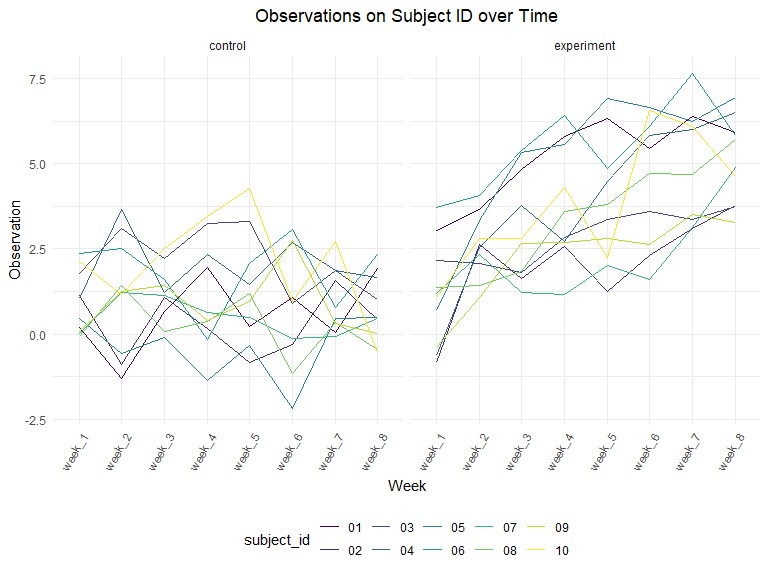

p8105_hw5_qra2000
================
Quinn Anderson
2023-11-14

### Setup, load libraries, and set seed for reproducibility.

``` r
library(tidyverse)
```

    ## ── Attaching core tidyverse packages ──────────────────────── tidyverse 2.0.0 ──
    ## ✔ dplyr     1.1.3     ✔ readr     2.1.4
    ## ✔ forcats   1.0.0     ✔ stringr   1.5.0
    ## ✔ ggplot2   3.4.3     ✔ tibble    3.2.1
    ## ✔ lubridate 1.9.2     ✔ tidyr     1.3.0
    ## ✔ purrr     1.0.2     
    ## ── Conflicts ────────────────────────────────────────── tidyverse_conflicts() ──
    ## ✖ dplyr::filter() masks stats::filter()
    ## ✖ dplyr::lag()    masks stats::lag()
    ## ℹ Use the conflicted package (<http://conflicted.r-lib.org/>) to force all conflicts to become errors

``` r
knitr::opts_chunk$set(
    echo = TRUE,
    warning = FALSE,
    fig.width = 8, 
  fig.height = 6,
  out.width = "90%")

theme_set(
  theme_minimal() +
  theme(legend.position = "bottom", plot.title = element_text(hjust = 0.5)))

options(
  ggplot2.continuous.colour = "viridis",
  ggplot2.continuous.fill = "viridis")

scale_colour_discrete = scale_colour_viridis_d
scale_fill_discrete = scale_fill_viridis_d

set.seed(12345)
```

## Problem 2

Below is a tidy dataframe containing data from all participants,
including the subject ID, control arm, and observations over time:

``` r
load_study_data = list.files("./data", pattern = ".csv", all.files = FALSE, full.names = FALSE)

tidy_study_data = data.frame(participants = load_study_data) |> 
  mutate(
    file_contents = map(participants, ~read.csv(file.path("./data", .)))) |> 
  separate(participants, into = c("control", "subject_id")) |> 
  unnest(file_contents) |> 
  mutate(control = recode(control, `con` = "control", `exp` = "experiment")) |> 
  pivot_longer(week_1:week_8,
               names_to = "week", 
               values_to = "observation")

tidy_study_data
```

    ## # A tibble: 160 × 4
    ##    control subject_id week   observation
    ##    <chr>   <chr>      <chr>        <dbl>
    ##  1 control 01         week_1        0.2 
    ##  2 control 01         week_2       -1.31
    ##  3 control 01         week_3        0.66
    ##  4 control 01         week_4        1.96
    ##  5 control 01         week_5        0.23
    ##  6 control 01         week_6        1.09
    ##  7 control 01         week_7        0.05
    ##  8 control 01         week_8        1.94
    ##  9 control 02         week_1        1.13
    ## 10 control 02         week_2       -0.88
    ## # ℹ 150 more rows

``` r
tidy_study_data |> 
  ggplot(aes(x = week, y = observation, group = subject_id, color = subject_id)) +
  geom_line() +
  labs(
    title = "Observations on Subject ID over Time",
       x = "Week",
       y = "Observation") +
  facet_grid(~control) +
  theme(axis.text.x = element_text(angle = 60, hjust = 1))
```



The spaghetti plot above shows observations on each subject over time
(weeks) during the course of the longitudinal study separated by control
and experimental groups. The observations in the experimental group
increase over the eight weeks, while the observations in the control
group decrease. Subject \#07 in the experimental group has the highest
number of observations at 7.5 at week 7. Subject \#06 in the control
group has the lowest number of observations at around -2.4.

## Problem 3

First, load the samples.
